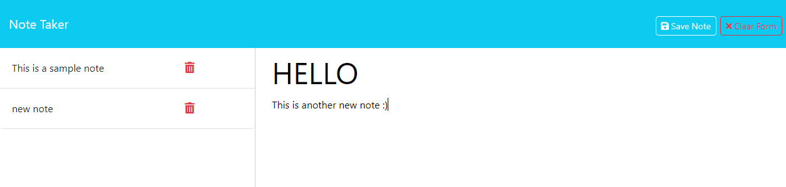

# Express.js Note Taker

## Description  (from the CWRU User Story)
The goal of this app is to provide small business owners with the ability to write and save notes.

## Table of Contents
I. [Acceptance Criteria](#acceptance-criteria-adpated-from-cwru-prompt)  
II. [Image of Working App](#image-of-working-app) 
III. [Render](https://express-note-taker-2nps.onrender.com/) 
IV. [Starter Code Credit](#starter-code-credit-httpsgithubcomcoding-boot-campminiature-eureka)

## Acceptance Criteria (adpated from CWRU prompt)
- WHEN I open the Note Taker
    - THEN I am presented with a landing page with link to NOTES PAGE
- WHEN I click the link to the NOTES PAGE
    - THEN I am presented with a page with existing notes in the left-hand column, and empty fields to enter new note titles/note text in the right-hand column
- WHEN I enter a new note title & text
    - THEN a "Save Note" and a "Clear Form" button appear in the nav at the top of the page
- WHEN I click the Save button
    - THEN the new note I have entered is saved and appears in the left-hand column with other existing notes and the buttons in the nav disappear
- WHEN I click on an existing in the left-hand column
    - THEN that note appears in the right-hand column and a "NEW NOTE" button appears in the nav
- WHEN I click the "NEW NOTE" button in the nav
    - THEN I am presented with empty fields to enter a new note title & text in the right-hand column, and the button disappears

## Image of Working App

## Link to Render
[Link](https://express-note-taker-2nps.onrender.com/)

### starter code credit: https://github.com/coding-boot-camp/miniature-eureka
